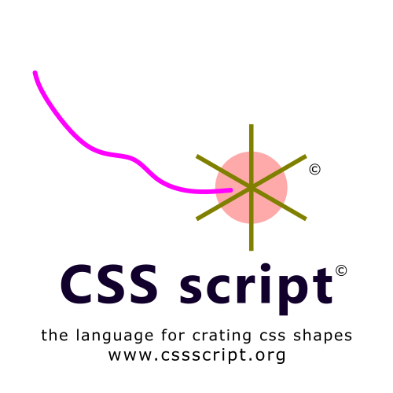
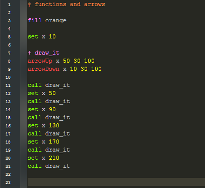
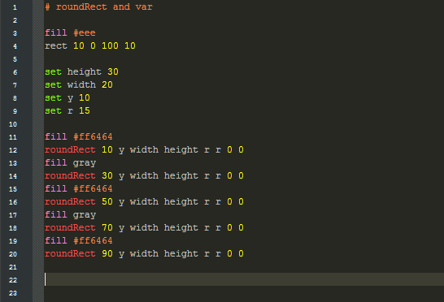

# css-script
css script : the script for css shapes

#

# file extention
.candy 

# 🍩 syntax appercu

# 📦 demo
[here](https://abdur-rahmaanj.github.io/css-script/)

# 📚 docs
[here](https://abdur-rahmaanj.github.io/css-script/reference/index.html)

# rights
all rights reserved cssscript.org, for code see license

# 🔧 quickstart
code in file.candy and run main.py 

# ⚗️ stability
beta

# contributing
have fun peeking around the source code and submitting pull requests !
